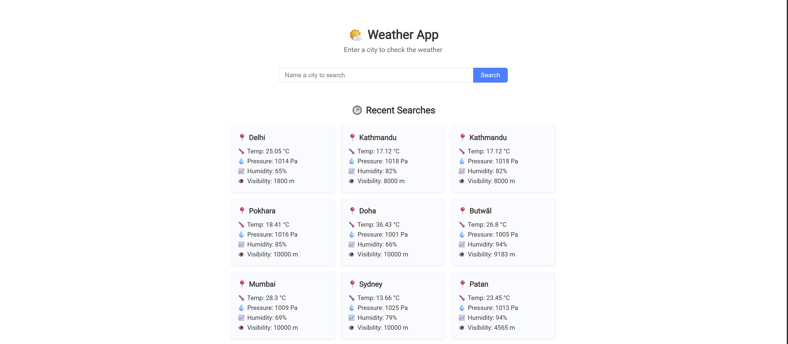

# 🌦 Weather App

A simple Flask-based web application that allows users to search for the current weather in any city and stores recent searches in an SQLite database. The app fetches real-time weather data from the [OpenWeatherMap API](https://openweathermap.org/api).

---

## 📌 Features

- Search for real-time weather by city name.
- Displays temperature, pressure, humidity, and visibility.
- Saves each search to an SQLite database.
- Shows a list of recent searches.
- Responsive and minimal UI.

---

## 🛠 Tech Stack

- **Backend:** Python, Flask  
- **Frontend:** HTML, CSS (Static files)  
- **Database:** SQLite  
- **API:** OpenWeatherMap API  

---

## 📂 Project Structure

```
weather-app/
│
├── app.py                 
├── search.db              
├── templates/
│   └── index.html         
├── static/
│   └── style.css          
└── README.md             
```

---

## ⚙️ Installation & Setup

1. **Clone the repository:**
   ```bash
   git clone https://github.com/your-username/weather-app.git
   cd weather-app
   ```

2. **Create and activate a virtual environment:**
   ```bash
   python -m venv venv
   source venv/bin/activate   # Mac/Linux
   venv\Scripts\activate      # Windows
   ```

3. **Install dependencies:**
   ```bash
   pip install flask requests
   ```

4. **Get an API key** from [OpenWeatherMap](https://home.openweathermap.org/api_keys).

5. **Update the API key** in `app.py`:
   ```python
   api_key = "YOUR_API_KEY"
   ```

6. **Run the app:**
   ```bash
   python app.py
   ```

7. **Open the browser** and visit:
   ```
   http://127.0.0.1:5000/
   ```

---

## 📸 Screenshots



---

## 📜 License

This project is open-source and available under the **MIT License**.
